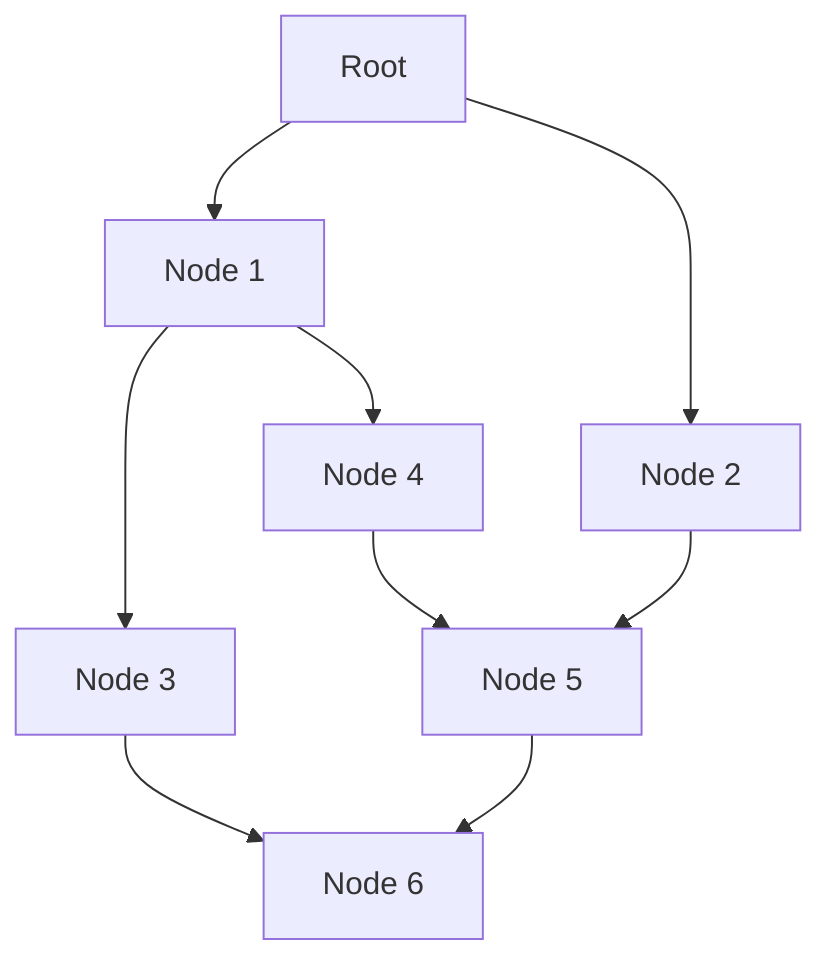
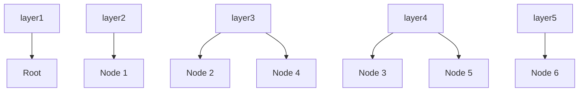

```mermaid
graph TD
    A[Root]
    B[Node 1]
    C[Node 2]
    D[Node 3]
    E[Node 4]
    F[Node 5]
    G[Node 6]

    A --> B
    A --> C
    B --> D
    B --> E
    E --> F
    C --> F
    D --> G
    F --> G
```

```mermaid
graph TD
    L1[layer1]
    L2[layer2]
    L3[layer3]
    L4[layer4]
    L5[layer5]

    A[Root]
    B[Node 1]
    C[Node 2]
    D[Node 3]
    E[Node 4]
    F[Node 5]
    G[Node 6]
    
    L1 --> A
    L2 --> B
    L3 --> C
    L3 --> E
    L4 --> D
    L4 --> F
    L5 --> G
```